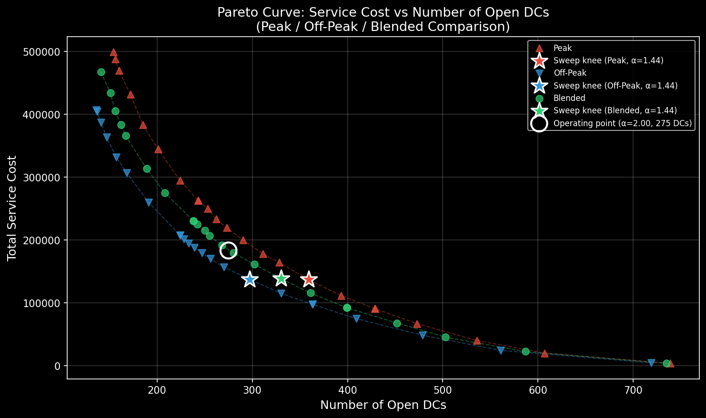
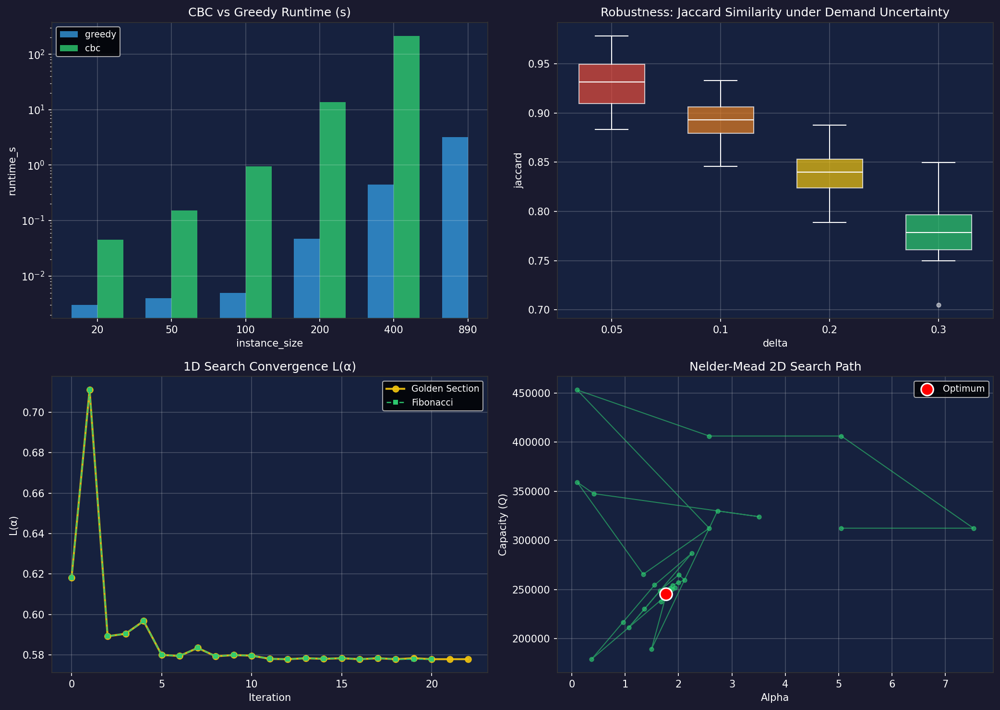

# Traffic-Aware Distribution Center Location — Istanbul

[](tests/)
[](requirements.txt)
[](model/cflp.py)
[](LICENSE)

Where should a last-mile delivery operator put its distribution centers (DCs) in Istanbul?

This project answers that with a **Capacitated Facility Location Problem (CFLP)** solved over all
**890 Istanbul neighborhoods** (14.9 M people), priced with **real commercial rents** and
**real measured traffic speeds** — a month of hourly IBB traffic data rather than straight-line
distance. It compares an exact MILP solver against a greedy heuristic, tunes the cost parameters
with four classical search algorithms, and stress-tests the result under demand uncertainty.

<p align="center">
  
</p>

---

## Headline results

At the tuned operating point (**α = 1.9967, Q = 200,000**):

| Traffic scenario | Open DCs | Total cost | Opening | Service | Mean travel time |
|------------------|---------:|-----------:|--------:|--------:|-----------------:|
| Peak (14:00–19:00)   | **301** | 486,346 | 298,621 | 187,725 | 0.94 h |
| Blended (24 h mean)  | **275** | 457,671 | 274,215 | 183,456 | 0.80 h |
| Off-peak (00:00–05:00) | **251** | 424,721 | 248,014 | 176,707 | 0.69 h |

**Traffic is not a detail.** Planning for rush hour instead of night-time conditions requires
**20 % more distribution centers** (301 vs. 251) to hold service cost at the same level. A model
built on raw distance would miss this entirely.

Three more findings:

| Question | Answer |
|----------|--------|
| Is the greedy heuristic good enough? | Within **7.4 %** of the proven optimum on average, while running **~190× faster** (median). CBC could not close the gap on 400 neighborhoods within its time limit; greedy solves all 890 in ~3 s. |
| Is the solution stable under demand uncertainty? | Yes. Perturbing every neighborhood's population by ±30 % still reproduces **78 %** of the same DC set (Jaccard); at ±5 % it is **93 %**. |
| Which parameter search wins? | Fibonacci reaches the same α as Golden Section with **2 fewer evaluations** (21 vs 23). In 2D, Nelder–Mead reaches a lower loss than the 1D optimum using **half the evaluations of a 10×10 grid** (52 vs 100). |

<p align="center">
  
</p>

Interactive maps of the resulting networks are in [`outputs/maps/`](outputs/maps/) — download an
HTML file and open it in a browser to explore each DC, its assigned neighborhoods, capacity usage
and rent.

---

## The model

**Decision variables**

- `y_j ∈ {0,1}` — open a DC at candidate location *j*
- `z_ij ∈ {0,1}` — assign neighborhood *i*'s demand to the DC at *j*

**Objective** — minimise opening cost plus traffic-weighted service cost:

```
min  Σ_j f_j · y_j  +  Σ_i Σ_j w_i · t_ij · z_ij

     f_j = α · r_j · √(Q / Q₀)
```

**Subject to**

| # | Constraint | Meaning |
|---|-----------|---------|
| 1 | `Σ_j z_ij = 1` ∀i | every neighborhood served by exactly one DC |
| 2 | `z_ij ≤ y_j` ∀i,j | assignment only to open DCs |
| 3 | `Σ_i w_i · z_ij ≤ Q · y_j` ∀j | DC capacity |
| 4 | `y_j, z_ij ∈ {0,1}` | integrality |

| Symbol | Meaning | Source |
|--------|---------|--------|
| `w_i` | population of neighborhood *i* | TUIK 2025 (14.9 M total) |
| `t_ij` | travel time *i → j*, hours | IBB hourly traffic, Oct 2024 |
| `r_j` | commercial rent, TL/m²/month | Endeksa (mean 425, range 73–1,328) |
| `α` | lease-footprint scaling factor | tuned by the outer search |
| `Q`, `Q₀` | DC capacity / reference capacity | 200,000 / 100,000 people |

### Two layers of optimisation

**Inner layer — solve the CFLP** for fixed (α, Q):

| Method | Description | Use case |
|--------|-------------|----------|
| **CBC** | Exact MILP via PuLP | ground truth, n ≤ 400 |
| **Greedy-add** | Opens the DC with the highest marginal gain, then re-assigns demand under capacity | all 890 neighborhoods, parameter sweeps |

**Outer layer — tune (α, Q)** by minimising the *knee-point loss* `L = N̂ + Ŝ`, the normalised
DC count plus normalised service cost. Four classical algorithms are compared:

| Method | Dimensions | Evaluations | Final L | α\* | Q\* |
|--------|-----------|------------:|--------:|------:|------:|
| Golden Section | 1D (α) | 23 | 0.5778 | 1.9967 | fixed 200,000 |
| Fibonacci | 1D (α) | 21 | 0.5778 | 1.9966 | fixed 200,000 |
| Nelder–Mead | 2D (α, Q) | 52 | 0.5720 | 1.7653 | 245,328 |
| Grid Search | 2D (α, Q) | 100 | 0.5497 | 1.2000 | 500,000 |

Grid search reports the lowest loss, but it lands **on the boundary** of the capacity range: the
loss keeps falling as Q grows, because one enormous DC minimises both terms. That is a modelling
artefact rather than a useful plan — a single facility serving 500,000 people is not an operable
last-mile depot — so the reported operating point is the **1D optimum at a fixed, operationally
plausible Q = 200,000**. See [Limitations](#limitations--what-id-do-next).

---

## Project structure

```
├── config.py                       # operating point + paths (single source of truth)
├── data/
│   ├── raw/                        # IBB GeoJSON, TUIK populations, Endeksa rents
│   ├── processed/                  # 890 neighborhoods + 3 travel-time matrices
│   ├── prepare_data.py             # end-to-end data pipeline
│   └── data.md                     # data documentation & provenance
├── model/
│   ├── cflp.py                     # CFLP solver (CBC exact + greedy heuristic)
│   └── robustness.py               # Monte Carlo robustness simulation
├── optimization/
│   └── search.py                   # Golden, Fibonacci, Nelder–Mead, Grid
├── experiments/
│   └── cbc_vs_greedy.py            # solver benchmark across instance sizes
├── tests/                          # 36 unit tests (pytest)
├── results/                        # pre-computed outputs (CSV / JSON)
├── notebook/main.ipynb             # analysis notebook + interactive dashboard
├── generate_outputs.py             # rebuilds every figure and map
└── outputs/{figures,maps}/         # static plots and Folium maps
```

## Data pipeline

`data/prepare_data.py` turns four public sources into a model-ready instance:

1. **Coordinates** — IBB *Muhtarlık* GeoJSON → 890 neighborhood centroids
2. **Population** — TUIK 2025 neighborhood populations (`w_i`), with 5 name aliases and 6 manual entries
3. **Rent** — Endeksa commercial rents; 83 % matched at neighborhood level, the rest filled from district averages
4. **Traffic** — IBB Hourly Traffic Density (Oct 2024): for each hour 0–23 the measured speed is
   averaged over *every day of the month*, per geohash cell. Each neighborhood inherits the profile
   of its 3 nearest cells. Peak = 6 slowest hours, off-peak = 6 fastest, blended = 24 h mean.
5. **Travel times** — Haversine distance ÷ harmonic mean of the two endpoints' speeds

Full provenance, matching statistics and known coverage gaps: [`data/data.md`](data/data.md).

---

## Getting started

```bash
pip install -r requirements.txt
```

Every result in this repo is committed, so you can explore without re-running anything. To
reproduce from scratch:

```bash
# 1. Rebuild the dataset (needs internet — fetches the IBB traffic API)
python data/prepare_data.py

# 2. Tune (α, Q) — writes results/search_*.json and search_comparison.csv   (~12 min)
python optimization/search.py
#    → then update ALPHA in config.py if the optimum moved

# 3. Benchmark the solvers                                                  (~5 min)
python experiments/cbc_vs_greedy.py

# 4. Robustness simulation — 120 solves                                     (~7 min)
python model/robustness.py

# 5. Rebuild all figures and maps                                           (~4 min)
python generate_outputs.py

# 6. Interactive analysis
jupyter notebook notebook/main.ipynb
```

> **Notebook tip:** the live map dashboard only appears once you run the final code cell —
> it does not render from the stored output.

> **Output naming:** the notebook and `generate_outputs.py` produce *different* visualisations and
> deliberately write to separate files, so neither overwrites the other:
>
> | Artifact | `generate_outputs.py` | Notebook |
> |----------|----------------------|----------|
> | Figures | `pareto_curve.png`, `results_summary.png` | `notebook_pareto_curve.png`, `notebook_results_summary.png` |
> | Maps | `interactive_map_{peak,offpeak,blended}.html` — all three scenarios | `notebook_preview_<scenario>.html` — written for whichever scenario the dropdown is on |

### Tests

```bash
python -m pytest tests/          # 36 tests, ~2 s
```

The suite covers the MILP formulation (every constraint verified against the returned solution),
the greedy heuristic (feasibility, capacity, first-pick correctness, rectangular instances),
the line searches (against analytic functions with known minima), and the robustness simulation
(valid Jaccard range, monotone degradation, reproducibility under a fixed seed).

---

## Limitations & what I'd do next

Honest notes on where this model stops:

- **Travel times are Haversine-based**, scaled by measured speeds. They capture *traffic*, not
  *road topology* — the Bosphorus crossings are the obvious casualty, since a bridge detour is
  invisible to a great-circle distance. A road-network routing API would be the next upgrade.
- **The knee-point loss is scale-dependent.** `L = N̂ + Ŝ` normalises over a pre-sampled box, so
  the same curve yields a slightly different knee depending on the sampling range — visible as the
  gap between the sweep knee in the Pareto figure and the search optimum. A loss expressed in
  currency (rent + driver-hours × wage) would remove the ambiguity and make α interpretable.
- **The 2D optimum sits on the capacity boundary**, which says the model has no mechanism to
  penalise implausibly large facilities. Adding a per-DC throughput ceiling or an explicit
  fixed+variable cost curve would make the Q dimension meaningful.
- **The greedy heuristic has no improvement phase.** Adding a drop/swap local search after the
  add phase would likely close a good part of the remaining 7.4 % gap to CBC.
- **Demand is static population.** Real parcel demand varies by district income and e-commerce
  penetration, and by hour of day.

---

## Team

A four-person course project at Istanbul Technical University.

| Member | Responsibility |
|--------|---------------|
| **Semih Çelik** | Data pipeline (IBB / TUIK / Endeksa integration, traffic-derived travel times), notebook & visualisation |
| **Alperen Sağlam** | CBC exact solver implementation, unit tests |
| **Furkan Kirteke** | Parameter search algorithms (Golden, Fibonacci, Nelder–Mead, Grid) |
| **Hasan Kan** | Greedy heuristic, robustness simulation |

## License

[MIT](LICENSE)
